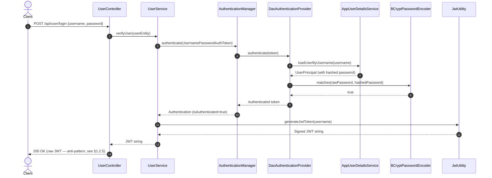
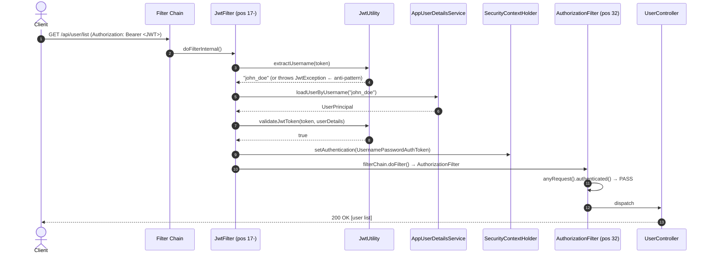
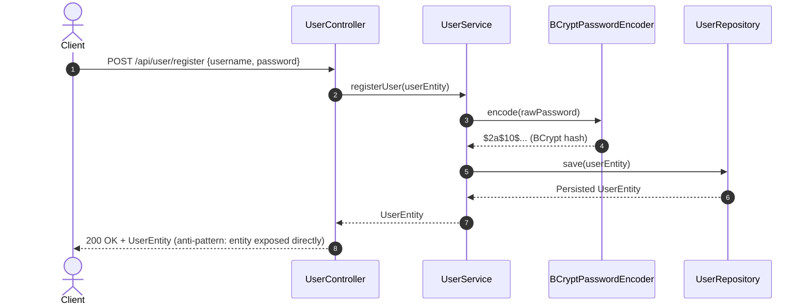
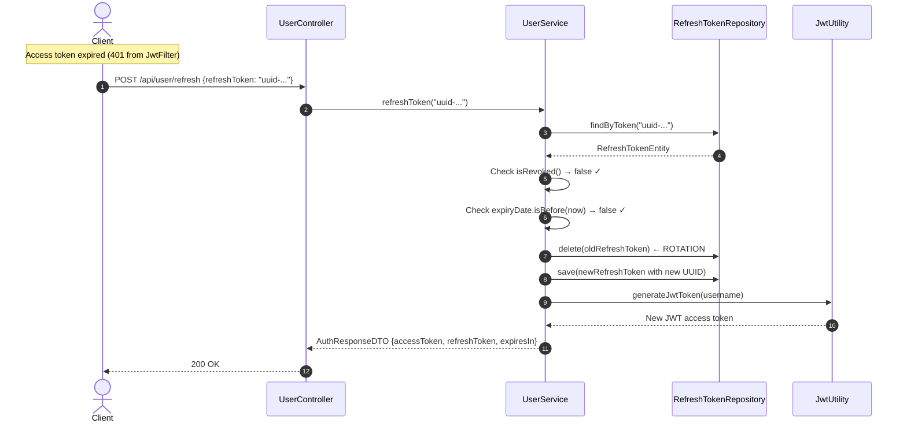

# Spring Security Master Guide & Interview Preparation

This document serves as the ultimate Spring Security reference and interview preparation guide, grounded entirely in this project's real codebase. It is structured into two parts:

- **PART 1** — Full end-to-end breakdown of [`spring-security-fundamentals`](file:///D:/Projects/spring-security-fundamentals), with every anti-pattern explicitly flagged and its fix shown.
- **PART 2** — Interview master guide: filter order, architecture, production extensions, project-specific follow-up Q&As, and 25 core interview questions with full answers.

---

## Table of Contents

- [PART 1: Full End-to-End Project Breakdown](#part-1-full-end-to-end-project-breakdown)
  - [1.1 Project Structure & Tech Stack](#11-project-structure--tech-stack)
  - [1.2 File-by-File Breakdown & Anti-Pattern Flags](#12-file-by-file-breakdown--anti-pattern-flags)
  - [1.3 End-to-End Execution Sequence Diagrams](#13-end-to-end-execution-sequence-diagrams)
- [PART 2: Interview Master Guide](#part-2-interview-master-guide)
  - [2.1 Predefined Filter Order](#21-predefined-filter-order-in-spring-security-critical-interview-topic)
  - [2.2 Core Architecture & Internal Mechanics](#22-core-spring-security-architecture--internal-mechanics)
  - [2.3 Production Fixes & Architecture Extensions](#23-production-fixes--architecture-extensions)
  - [2.4 Project-Specific Follow-Up Questions](#24-project-specific-follow-up-interview-questions)
  - [2.5 Top 25 Core Interview Questions](#25-top-25-spring-security-interview-questions--expert-answers)
  - [2.6 Quick Reference Matrix](#26-quick-reference-summary-matrix)

---

# PART 1: Full End-to-End Project Breakdown

## 1.1 Project Structure & Tech Stack

This project is a **Spring Boot 3 / Spring Security 6** application demonstrating stateless REST API authentication using **JSON Web Tokens (JWT)** via the `io.jsonwebtoken` (JJWT) library and **Spring Data JPA** with an H2 in-memory database.

```
spring-security-fundamentals
├── .env                                                  # Environment variables (loaded via spring.config.import)
├── pom.xml                                               # Dependencies: spring-security, jjwt, jpa, h2, web
└── src/main/java/com/springSecurity/fundamentals
    ├── FundamentalsApplication.java                     # Spring Boot entry point
    ├── configuration
    │   └── SecurityConfiguration.java                   # SecurityFilterChain, PasswordEncoder, AuthProvider beans
    ├── controller
    │   ├── BasicController.java                        # Demo endpoint for session/request info
    │   └── UserController.java                         # /register, /login, /list endpoints
    ├── entity
    │   └── UserEntity.java                             # JPA entity for the users table
    ├── filter
    │   └── JwtFilter.java                              # OncePerRequestFilter — JWT validation per request
    ├── repository
    │   └── UserRepository.java                         # JPA repository for UserEntity
    ├── service
    │   ├── AppUserDetailsService.java                  # UserDetailsService implementation (DB lookup)
    │   └── UserService.java                            # Registration, login verification, JWT issuance
    └── utility.classes
        ├── JwtUtility.java                             # Token generation, parsing, validation (JJWT)
        └── UserPrincipal.java                          # UserDetails adapter wrapping UserEntity
```

---

## 1.2 File-by-File Breakdown & Anti-Pattern Flags

### 1. [`SecurityConfiguration.java`](file:///D:/Projects/spring-security-fundamentals/src/main/java/com/springSecurity/fundamentals/configuration/SecurityConfiguration.java)

Central configuration class. Defines the security filter chain and core infrastructure beans.

**Key Annotations:**
- `@EnableWebSecurity` — activates Spring Security's web support; imports `WebSecurityConfiguration`.
- `@EnableMethodSecurity` — enables `@PreAuthorize`, `@PostAuthorize`, `@Secured` on beans.

**Configured Bean: `securityFilterChain`**
- `.csrf(csrf -> csrf.disable())` — safe for stateless REST APIs (see Follow-Up Q7).
- `.authorizeHttpRequests(...)` — `/register` and `/login` are `permitAll()`; everything else requires `authenticated()`.
- `.sessionManagement(... STATELESS)` — Spring Security will never create or consult `HttpSession`.
- `.addFilterBefore(jwtFilter, UsernamePasswordAuthenticationFilter.class)` — inserts `JwtFilter` into the chain one position before `UsernamePasswordAuthenticationFilter` (position 17 in the standard order).
- `.formLogin(...)` and `.httpBasic(...)` — **these are currently active alongside JWT** (see Anti-Pattern below).

**Configured Beans: infrastructure**
- `BCryptPasswordEncoder` — adaptive hashing with random salt; plugged into `DaoAuthenticationProvider`.
- `DaoAuthenticationProvider` — wired with `AppUserDetailsService` and the password encoder; performs username/password verification during login.
- `AuthenticationManager` — fetched from `AuthenticationConfiguration` and exposed as a bean so `UserService` can inject and invoke it directly.

> [!CAUTION]
> **Anti-Pattern: `.formLogin()` and `.httpBasic()` active on a stateless JWT API**
> The current config calls both `.formLogin(Customizer.withDefaults())` and `.httpBasic(Customizer.withDefaults())`. This activates `UsernamePasswordAuthenticationFilter` (for form-based POST `/login`) and `BasicAuthenticationFilter` in the chain alongside `JwtFilter`. On a pure REST/JWT API these are redundant and add attack surface. They should be explicitly disabled:
> ```java
> .formLogin(form -> form.disable())
> .httpBasic(basic -> basic.disable())
> ```

> [!CAUTION]
> **Anti-Pattern: Missing `AuthenticationEntryPoint` and `AccessDeniedHandler`**
> When an unauthenticated request hits a protected endpoint, Spring Security's default `Http403ForbiddenEntryPoint` returns a bare `403` with no body. On expired/invalid JWTs the default fallback produces empty or HTML responses. A production REST API must register custom handlers for consistent JSON error payloads.

---

### 2. [`JwtFilter.java`](file:///D:/Projects/spring-security-fundamentals/src/main/java/com/springSecurity/fundamentals/filter/JwtFilter.java)

Extends `OncePerRequestFilter` — guarantees exactly one execution per request, regardless of internal Servlet dispatches (`FORWARD`, `ERROR`, `INCLUDE`).

**Execution workflow:**
1. Reads `Authorization` header; extracts the Bearer token string.
2. Calls `jwtUtility.extractUsername(token)` — this calls `Jwts.parser().verifyWith(key).build().parseSignedClaims(token)`, which throws `ExpiredJwtException`, `MalformedJwtException`, or `SignatureException` on any invalid token.
3. If username is non-null and `SecurityContextHolder.getContext().getAuthentication() == null` (prevents re-processing on an already-authenticated thread):
   - Loads `UserDetails` via `AppUserDetailsService`.
   - Calls `jwtUtility.validateJwtToken(token, userDetails)` — verifies username match and re-checks expiration.
   - Creates `UsernamePasswordAuthenticationToken(userDetails, null, userDetails.getAuthorities())`.
   - Stamps request details via `WebAuthenticationDetailsSource`.
   - Sets the token into `SecurityContextHolder` — this is what Spring Security's `AuthorizationFilter` (position 32) reads.
4. Passes control downstream with `filterChain.doFilter(request, response)`.

> [!CAUTION]
> **Anti-Pattern: Uncaught JJWT exceptions in `doFilterInternal`**
> If `extractUsername(token)` throws `ExpiredJwtException` or `MalformedJwtException`, the exception propagates up the filter chain unhandled. It is then caught by `ExceptionTranslationFilter`, which delegates to `AuthenticationEntryPoint` — but only if `ExceptionTranslationFilter` recognises it as an `AuthenticationException`. JJWT exceptions are *not* Spring Security exceptions, so the behaviour is undefined (typically a `500` or a silent empty response). The correct fix is to wrap the parsing logic in a `try-catch` inside the filter:
> ```java
> @Override
> protected void doFilterInternal(HttpServletRequest request,
>                                  HttpServletResponse response,
>                                  FilterChain filterChain) throws ServletException, IOException {
>     String authHeader = request.getHeader("Authorization");
>     String token = null;
>     String username = null;
>
>     if (authHeader != null && authHeader.startsWith("Bearer ")) {
>         token = authHeader.substring(7);
>         try {
>             username = jwtUtility.extractUsername(token);
>         } catch (ExpiredJwtException e) {
>             // Let AuthenticationEntryPoint handle it by writing the response here
>             response.setStatus(HttpServletResponse.SC_UNAUTHORIZED);
>             response.setContentType(MediaType.APPLICATION_JSON_VALUE);
>             response.getWriter().write("{\"error\":\"Token has expired\"}");
>             return; // Stop filter chain
>         } catch (JwtException e) {
>             response.setStatus(HttpServletResponse.SC_UNAUTHORIZED);
>             response.setContentType(MediaType.APPLICATION_JSON_VALUE);
>             response.getWriter().write("{\"error\":\"Invalid JWT token\"}");
>             return;
>         }
>     }
>     // ... rest of validation logic
>     filterChain.doFilter(request, response);
> }
> ```

---

### 3. [`JwtUtility.java`](file:///D:/Projects/spring-security-fundamentals/src/main/java/com/springSecurity/fundamentals/utility/classes/JwtUtility.java)

Manages all cryptographic JWT operations using the JJWT fluent builder API.

**Current implementation highlights:**
- Constructor calls `getKey()` which runs `KeyGenerator.getInstance("HmacSHA256").generateKey()`.
- Token expiration: `nowMillis + 60000` — note there is a **bug** here: `expMillis = nowMillis + 60000` and then `exp = new Date(nowMillis + expMillis)`, making the actual expiry **~33 hours** not 60 seconds (it adds `nowMillis` twice).
- Signing algorithm: HS256 (symmetric HMAC-SHA256).

> [!CAUTION]
> **Anti-Pattern 1: In-memory key generated on every restart (multi-instance killer)**
> `KeyGenerator.getInstance("HmacSHA256").generateKey()` produces a different random key each JVM startup. All tokens issued before a restart immediately fail signature validation. In a multi-instance cluster (e.g., two pods behind a load balancer), each instance holds a different key — a token signed by Instance A is rejected by Instance B. Fix is described in section 2.3.1.

> [!WARNING]
> **Bug: Token expiration arithmetic is wrong**
> ```java
> long expMillis = nowMillis + 60000;           // expMillis ≈ current epoch ms + 60 seconds
> Date exp = new Date(nowMillis + expMillis);  // exp = nowMillis + nowMillis + 60000 ≈ now + 33 hours
> ```
> The variable name `expMillis` is misleading — it holds an absolute epoch timestamp, not a duration. The intended 60-second expiry is never actually enforced. The fix is:
> ```java
> long durationMs = 60_000L; // 60 seconds
> Date exp = new Date(nowMillis + durationMs);
> ```

> [!CAUTION]
> **Anti-Pattern 2: Hardcoded expiry without Refresh Token mechanism**
> Regardless of the arithmetic bug, the intended 60-second expiry (or any short expiry) without a Refresh Token flow forces users to re-authenticate constantly. Fix is described in section 2.3.4.

---

### 4. [`AppUserDetailsService.java`](file:///D:/Projects/spring-security-fundamentals/src/main/java/com/springSecurity/fundamentals/service/AppUserDetailsService.java) & [`UserPrincipal.java`](file:///D:/Projects/spring-security-fundamentals/src/main/java/com/springSecurity/fundamentals/utility/classes/UserPrincipal.java)

`AppUserDetailsService` implements `UserDetailsService` — the bridge between the Spring Security authentication machinery and the application's database layer. `DaoAuthenticationProvider` calls `loadUserByUsername(username)` during the login flow.

`UserPrincipal` implements `UserDetails` — wraps `UserEntity` so Spring Security can interrogate the principal's password, username, authorities, and account status flags.

> [!CAUTION]
> **Anti-Pattern: Hardcoded single authority `"USER"` — breaks RBAC entirely**
> ```java
> // Current code in UserPrincipal.java
> public Collection<? extends GrantedAuthority> getAuthorities() {
>     return List.of(new SimpleGrantedAuthority("USER")); // Hardcoded — ignores DB roles
> }
> ```
> This string `"USER"` has no `ROLE_` prefix, so it is not a role — it is a bare authority. Any `@PreAuthorize("hasRole('USER')")` check would fail because Spring Security looks for `ROLE_USER` when using `hasRole()`. And since every user gets the same authority regardless of database state, all role-based endpoints are equivalent. Fix is described in section 2.3.3.

---

### 5. [`UserService.java`](file:///D:/Projects/spring-security-fundamentals/src/main/java/com/springSecurity/fundamentals/service/UserService.java) & [`UserController.java`](file:///D:/Projects/spring-security-fundamentals/src/main/java/com/springSecurity/fundamentals/controller/UserController.java)

**Registration** (`POST /api/user/register`): takes `UserEntity` as request body, encodes the password via `BCryptPasswordEncoder.encode()`, sets id to `null` to prevent client-supplied ID injection, saves to database, and returns the saved entity.

**Login** (`POST /api/user/login`): takes credentials as `UserEntity` request body. Delegates verification to `authenticationManager.authenticate(new UsernamePasswordAuthenticationToken(username, password))` — this internally calls `DaoAuthenticationProvider`, which calls `AppUserDetailsService.loadUserByUsername()` and verifies the password via `BCryptPasswordEncoder.matches()`. On success, calls `jwtUtility.generateJwtToken(username, password)` and returns the raw token string.

**List** (`GET /api/user/list`): protected endpoint returning all registered users.

> [!CAUTION]
> **Anti-Pattern 1: `UserEntity` used as both a JPA entity and a request DTO**
> Accepting `UserEntity` directly as a `@RequestBody` in controller endpoints exposes JPA entity fields (including `id`, `roles`) to client input. A client can send `{"id": 1, "username": "hacker", "password": "x"}` and risk unexpected behaviour. Entities should never be used as HTTP request/response bodies — use dedicated DTO classes (`RegisterRequestDTO`, `LoginRequestDTO`, `AuthResponseDTO`).

> [!CAUTION]
> **Anti-Pattern 2: Login response is a raw `String` with no HTTP status differentiation**
> `verifyUser()` returns the JWT string on success or the literal string `"Failed"` on failure — both returned as HTTP `200 OK`. A client cannot distinguish success from failure without parsing the response body. The correct approach returns `200 OK` with an `AuthResponseDTO` on success and throws an exception (which maps to `401 Unauthorized`) on failure.

> [!NOTE]
> **`generateJwtToken(username, password)` — password parameter is unused**
> The current signature accepts both `username` and `password`, but the JJWT builder inside `generateJwtToken` only uses `username` as the subject claim. The `password` parameter is dead code. The fixed version (section 2.3.1) removes it to `generateJwtToken(String username)`. This is a **breaking change** to `UserService.verifyUser()` which must be updated simultaneously.

---

## 1.3 End-to-End Execution Sequence Diagrams

### Login Flow (with DaoAuthenticationProvider internals)


### Protected Request Flow (JwtFilter pipeline)


### Registration Flow


---

# PART 2: Interview Master Guide

---

## 2.1 Predefined Filter Order in Spring Security (CRITICAL INTERVIEW TOPIC)

Spring Security registers its built-in filters with explicit numeric ordering defined in `FilterOrderRegistration`. When you use `addFilterBefore` / `addFilterAfter` / `addFilterAt`, you are inserting relative to these positions. Understanding the order is essential because **the wrong order causes silent security failures**.

### Complete Standard Filter Order Table

| # | Filter | What it does |
|:---:|:---|:---|
| **1** | `DisableEncodeUrlFilter` | Prevents session ID leakage via URL encoding (`jsessionid` in URLs). |
| **2** | `ForceEagerSessionCreationFilter` | Creates a session eagerly if configured (rare). |
| **3** | `ChannelProcessingFilter` | Enforces HTTPS by redirecting HTTP → HTTPS based on `requiresSecureChannel()` rules. |
| **4** | `WebAsyncManagerIntegrationFilter` | Propagates `SecurityContext` into `WebAsyncManager` so async MVC methods see the same principal. |
| **5** | `SecurityContextHolderFilter` | Loads the `SecurityContext` from `SecurityContextRepository` at request start. Clears it at request end. *(Replaced `SecurityContextPersistenceFilter` in Spring Security 6.)* |
| **6** | `HeaderWriterFilter` | Writes security-related response headers: `X-Frame-Options`, `X-XSS-Protection`, `X-Content-Type-Options`, `Strict-Transport-Security`. |
| **7** | `CorsFilter` | Handles CORS preflight (`OPTIONS`) and sets CORS response headers. Must run before auth so unauthenticated preflight is allowed. |
| **8** | `CsrfFilter` | Validates the CSRF token on mutating requests. Runs before auth filters to reject invalid tokens cheaply. |
| **9** | `LogoutFilter` | Intercepts the logout URL, clears `SecurityContext`, invalidates session, runs `LogoutHandler` chain. |
| **10** | `OAuth2AuthorizationRequestRedirectFilter` | Redirects to the OAuth2 authorization endpoint when the client initiates the authorization code flow. |
| **11** | `Saml2WebSsoAuthenticationRequestFilter` | Initiates SAML 2.0 SSO authentication requests. |
| **12** | `X509AuthenticationFilter` | Extracts client certificate from TLS handshake and authenticates via X.509. |
| **13** | `AbstractPreAuthenticatedProcessingFilter` | Reads pre-authenticated credentials from headers (e.g., set by a reverse proxy or API gateway). |
| **14** | `CasAuthenticationFilter` | Processes CAS service tickets for SSO authentication. |
| **15** | `OAuth2LoginAuthenticationFilter` | Handles the OAuth2 authorization code callback (`/login/oauth2/code/*`). |
| **16** | `Saml2WebSsoAuthenticationFilter` | Processes inbound SAML 2.0 assertions. |
| **17** | `UsernamePasswordAuthenticationFilter` | Intercepts `POST /login` form submissions. Extracts username/password and delegates to `AuthenticationManager`. **This is where `JwtFilter` is inserted before (`addFilterBefore`).** |
| **18** | `DefaultLoginPageGeneratingFilter` | Auto-generates the default HTML login form page. |
| **19** | `DefaultLogoutPageGeneratingFilter` | Auto-generates the default HTML logout confirmation page. |
| **20** | `ConcurrentSessionFilter` | Enforces concurrent session limits using `SessionRegistry`. |
| **21** | `DigestAuthenticationFilter` | Processes HTTP Digest Auth headers (`Authorization: Digest ...`). |
| **22** | `BearerTokenAuthenticationFilter` | Processes OAuth2 Bearer tokens for Resource Server configurations. |
| **23** | `BasicAuthenticationFilter` | Processes HTTP Basic Auth headers (`Authorization: Basic <base64>`). |
| **24** | `RequestCacheAwareFilter` | Replays the original request from `RequestCache` after a successful redirect-based login. |
| **25** | `SecurityContextHolderAwareRequestFilter` | Wraps `HttpServletRequest` to expose `request.isUserInRole()` and `request.getUserPrincipal()`. |
| **26** | `JaasApiIntegrationFilter` | Propagates JAAS `Subject` for legacy JAAS-based integrations. |
| **27** | `RememberMeAuthenticationFilter` | Reads a Remember-Me cookie and authenticates automatically if `SecurityContext` is empty. |
| **28** | `AnonymousAuthenticationFilter` | Injects an `AnonymousAuthenticationToken` (with `ROLE_ANONYMOUS`) if no prior filter set an `Authentication`. Ensures `SecurityContext` is never null. |
| **29** | `OAuth2AuthorizationCodeGrantFilter` | Processes OAuth2 authorization code grants for the Resource Server. |
| **30** | `SessionManagementFilter` | Applies session fixation protection and concurrency control after authentication. |
| **31** | `ExceptionTranslationFilter` | Wraps the remaining chain in `try-catch`. Routes `AuthenticationException` to `AuthenticationEntryPoint` and `AccessDeniedException` to `AccessDeniedHandler`. |
| **32** | `AuthorizationFilter` | Evaluates `requestMatchers(...)` and method-security rules. Throws `AccessDeniedException` if authorization fails. *(Replaced `FilterSecurityInterceptor` in Spring Security 6.)* |

---

### Why Order Matters — Exam-Grade Answers

> [!IMPORTANT]
> **CORS before CSRF before Auth — and why:**
> 1. **`CorsFilter` (#7) before `CsrfFilter` (#8)**: Browser preflight `OPTIONS` requests carry no cookies and no CSRF tokens. `CsrfFilter` would reject them with 403. `CorsFilter` processes preflight and returns early before CSRF evaluation.
> 2. **`CsrfFilter` (#8) before all auth filters (#17+)**: Unauthenticated mutating requests with invalid CSRF tokens are rejected immediately — no expensive DB lookup or password hash occurs.
> 3. **`ExceptionTranslationFilter` (#31) wraps `AuthorizationFilter` (#32)**: It's a try-catch wrapper, not a sibling — it *must* execute before the filter it catches exceptions from.
> 4. **`JwtFilter` inserted before position #17**: This ensures the JWT is validated and the `SecurityContext` is populated *before* `UsernamePasswordAuthenticationFilter` runs. If inserted after, form-login logic would run on unauthenticated JWT requests unnecessarily.
> 5. **`AnonymousAuthenticationFilter` (#28) before `ExceptionTranslationFilter` (#31)**: It guarantees `authentication.getPrincipal()` is never null — anonymous users get `AnonymousAuthenticationToken` instead of null, making permission checks uniform.

---

## 2.2 Core Spring Security Architecture & Internal Mechanics

### The Filter Delegation Chain
```
HTTP Request
    │
    ▼
Servlet Container (Tomcat)
    │
    ▼
DelegatingFilterProxy            ← Standard Servlet filter; registered in web container
    │  (looks up by bean name "springSecurityFilterChain")
    ▼
FilterChainProxy                 ← Spring-managed bean; holds list of SecurityFilterChains
    │  (matches request to correct chain via RequestMatcher)
    ▼
SecurityFilterChain              ← Ordered list of security filters for this app
    │
    ├── SecurityContextHolderFilter
    ├── CorsFilter
    ├── CsrfFilter
    ├── JwtFilter  ← custom, inserted via addFilterBefore(jwtFilter, UsernamePasswordAuthenticationFilter.class)
    ├── UsernamePasswordAuthenticationFilter
    ├── ExceptionTranslationFilter
    └── AuthorizationFilter
    │
    ▼
DispatcherServlet → Controller
```

### Authentication Object Lifecycle
```
Login request arrives
    │
    ▼
AuthenticationManager.authenticate(UsernamePasswordAuthenticationToken[username, password, NOT_AUTHENTICATED])
    │  ProviderManager iterates AuthenticationProviders
    ▼
DaoAuthenticationProvider
    ├── UserDetailsService.loadUserByUsername(username) → UserDetails
    └── PasswordEncoder.matches(rawPwd, storedHash) → true
    │
    ▼
Returns UsernamePasswordAuthenticationToken[principal=UserPrincipal, credentials=null, AUTHENTICATED, authorities]
    │  credentials erased automatically by ProviderManager after authentication
    ▼
SecurityContextHolder.getContext().setAuthentication(token)
    │
    ▼
AuthorizationFilter reads Authentication from SecurityContextHolder → evaluates rules
```

### SecurityContext & ThreadLocal Storage
`SecurityContextHolder` uses `ThreadLocal` by default (`MODE_THREADLOCAL`). This means:
- Each thread processing an HTTP request has its own isolated `SecurityContext`.
- At request end, `SecurityContextHolderFilter` clears the context to prevent context leaks between pooled threads.
- **For async processing**: If you spawn child threads (e.g., `@Async`), they do *not* inherit the `SecurityContext` from the parent thread by default. Use `MODE_INHERITABLETHREADLOCAL` or pass the context explicitly via `DelegatingSecurityContextRunnable`.

---

## 2.3 Production Fixes & Architecture Extensions

### 2.3.1 Fix: Externalize the HMAC Signing Key

#### Root Cause
```java
// Current JwtUtility constructor — generates a NEW random key every restart
private SecretKey getKey() {
    KeyGenerator keyGenerator = KeyGenerator.getInstance("HmacSHA256");
    SecretKey generatedKey = keyGenerator.generateKey(); // ← different key every time
    String secretKey = Base64.getEncoder().encodeToString(generatedKey.getEncoded());
    return Keys.hmacShaKeyFor(secretKey.getBytes(StandardCharsets.UTF_8));
}
```

#### Fix: Load a static 256-bit key from the environment

This project already has a `.env` file and `spring.config.import` in place — extend it:

**`.env` (at project root, NOT committed to git):**
```env
JWT_SECRET=c3ByaW5nLXNlY3VyaXR5LWZ1bmRhbWVudGFscy1zZWNyZXQta2V5LTMyLWJ5dGVzLWxvbmcK
JWT_EXPIRATION_MS=900000
```

**`application.properties`:**
```properties
spring.config.import=optional:file:.env[.properties]
jwt.secret=${JWT_SECRET}
jwt.expiration-ms=${JWT_EXPIRATION_MS:900000}
```

**Updated `JwtUtility.java`:**
```java
@Service
public class JwtUtility {

    @Value("${jwt.secret}")
    private String secretKeyBase64;

    @Value("${jwt.expiration-ms:900000}")
    private long jwtExpirationMs;

    private SecretKey getSigningKey() {
        byte[] keyBytes = Decoders.BASE64.decode(secretKeyBase64);
        return Keys.hmacShaKeyFor(keyBytes); // requires ≥ 256 bits (32 bytes)
    }

    // NOTE: Password parameter removed — it was unused dead code
    public String generateJwtToken(String username) {
        Date now = new Date();
        return Jwts.builder()
                .subject(username)
                .issuedAt(now)
                .expiration(new Date(now.getTime() + jwtExpirationMs)) // Fixed arithmetic bug
                .signWith(getSigningKey())
                .compact();
    }

    public boolean validateJwtToken(String jwtToken, UserDetails userDetails) {
        final String username = extractUsername(jwtToken);
        return username.equals(userDetails.getUsername()) && !isTokenExpired(jwtToken);
    }

    public String extractUsername(String jwtToken) {
        return extractClaim(jwtToken, Claims::getSubject);
    }

    public <T> T extractClaim(String token, Function<Claims, T> claimsResolver) {
        return claimsResolver.apply(extractAllClaims(token));
    }

    private Claims extractAllClaims(String token) {
        return Jwts.parser()
                .verifyWith(getSigningKey())
                .build()
                .parseSignedClaims(token)
                .getPayload();
    }

    private boolean isTokenExpired(String token) {
        return extractClaim(token, Claims::getExpiration).before(new Date());
    }
}
```

> [!IMPORTANT]
> **Update `UserService.verifyUser()` simultaneously** — the `generateJwtToken` signature changed from `(username, password)` to `(username)`:
> ```java
> // Before
> return jwtUtility.generateJwtToken(username, password);
> // After
> return jwtUtility.generateJwtToken(username);
> ```

---

### 2.3.2 Fix: Custom `AuthenticationEntryPoint` + `AccessDeniedHandler` + `@ControllerAdvice`

#### Understanding the exception dispatch boundary
```
Filter Chain (before DispatcherServlet)           Spring MVC (after DispatcherServlet)
─────────────────────────────────────────────     ──────────────────────────────────
JwtFilter throws JwtException (JJWT)         →   @ControllerAdvice CANNOT catch this
ExceptionTranslationFilter catches it        →   Routes to AuthenticationEntryPoint ✓
                                                  
Controller throws RuntimeException           →   @ControllerAdvice CAN catch this ✓
```

#### `JwtAuthenticationEntryPoint.java`
```java
@Component
public class JwtAuthenticationEntryPoint implements AuthenticationEntryPoint {

    private final ObjectMapper objectMapper = new ObjectMapper();

    @Override
    public void commence(HttpServletRequest request,
                         HttpServletResponse response,
                         AuthenticationException authException) throws IOException {
        response.setContentType(MediaType.APPLICATION_JSON_VALUE);
        response.setStatus(HttpServletResponse.SC_UNAUTHORIZED);

        Map<String, Object> body = new LinkedHashMap<>();
        body.put("timestamp", Instant.now().toString());
        body.put("status", 401);
        body.put("error", "Unauthorized");
        body.put("message", resolveMessage(request, authException));
        body.put("path", request.getRequestURI());

        objectMapper.writeValue(response.getOutputStream(), body);
    }

    private String resolveMessage(HttpServletRequest request, AuthenticationException ex) {
        // Surface JJWT-specific error if stored as request attribute by JwtFilter's catch block
        Object jwtError = request.getAttribute("jwt.error");
        if (jwtError != null) return jwtError.toString();
        return ex.getMessage() != null ? ex.getMessage() : "Authentication required";
    }
}
```

#### `JwtAccessDeniedHandler.java`
```java
@Component
public class JwtAccessDeniedHandler implements AccessDeniedHandler {

    private final ObjectMapper objectMapper = new ObjectMapper();

    @Override
    public void handle(HttpServletRequest request,
                       HttpServletResponse response,
                       AccessDeniedException accessDeniedException) throws IOException {
        response.setContentType(MediaType.APPLICATION_JSON_VALUE);
        response.setStatus(HttpServletResponse.SC_FORBIDDEN);

        Map<String, Object> body = new LinkedHashMap<>();
        body.put("timestamp", Instant.now().toString());
        body.put("status", 403);
        body.put("error", "Forbidden");
        body.put("message", "You do not have permission to access this resource");
        body.put("path", request.getRequestURI());

        objectMapper.writeValue(response.getOutputStream(), body);
    }
}
```

#### Updated `SecurityConfiguration.java` (exceptionHandling wiring)
```java
private final JwtAuthenticationEntryPoint jwtAuthenticationEntryPoint;
private final JwtAccessDeniedHandler jwtAccessDeniedHandler;

@Bean
public SecurityFilterChain securityFilterChain(HttpSecurity http) throws Exception {
    return http
            .csrf(csrf -> csrf.disable())
            .formLogin(form -> form.disable())         // Disable unused form login
            .httpBasic(basic -> basic.disable())       // Disable unused HTTP Basic
            .exceptionHandling(ex -> ex
                    .authenticationEntryPoint(jwtAuthenticationEntryPoint) // 401
                    .accessDeniedHandler(jwtAccessDeniedHandler)           // 403
            )
            .authorizeHttpRequests(request -> request
                    .requestMatchers("/api/user/register", "/api/user/login", "/api/user/refresh").permitAll()
                    .anyRequest().authenticated())
            .sessionManagement(session -> session.sessionCreationPolicy(SessionCreationPolicy.STATELESS))
            .addFilterBefore(jwtFilter, UsernamePasswordAuthenticationFilter.class)
            .build();
}
```

#### `GlobalExceptionHandler.java` (controller-layer exceptions only)
```java
@RestControllerAdvice
public class GlobalExceptionHandler {

    @ExceptionHandler(BadCredentialsException.class)
    public ResponseEntity<Map<String, Object>> handleBadCredentials(BadCredentialsException ex,
                                                                     HttpServletRequest request) {
        return buildErrorResponse(HttpStatus.UNAUTHORIZED, "Invalid username or password", request);
    }

    @ExceptionHandler(UsernameNotFoundException.class)
    public ResponseEntity<Map<String, Object>> handleUserNotFound(UsernameNotFoundException ex,
                                                                   HttpServletRequest request) {
        return buildErrorResponse(HttpStatus.UNAUTHORIZED, "Invalid username or password", request);
        // Deliberately same message as BadCredentials — don't leak whether user exists
    }

    @ExceptionHandler(AccessDeniedException.class)
    public ResponseEntity<Map<String, Object>> handleAccessDenied(AccessDeniedException ex,
                                                                    HttpServletRequest request) {
        return buildErrorResponse(HttpStatus.FORBIDDEN, "Access denied", request);
    }

    private ResponseEntity<Map<String, Object>> buildErrorResponse(HttpStatus status, String message,
                                                                     HttpServletRequest request) {
        Map<String, Object> body = new LinkedHashMap<>();
        body.put("timestamp", Instant.now().toString());
        body.put("status", status.value());
        body.put("error", status.getReasonPhrase());
        body.put("message", message);
        body.put("path", request.getRequestURI());
        return ResponseEntity.status(status).body(body);
    }
}
```

> [!NOTE]
> **Why `AccessDeniedException` appears in both places:** `@ControllerAdvice` handles `AccessDeniedException` thrown inside controllers/services (e.g., from `@PreAuthorize` when Spring AOP is involved). `JwtAccessDeniedHandler` handles it when `AuthorizationFilter` itself throws it (pre-controller). Having both ensures full coverage.

---

### 2.3.3 Fix: Real Role-Based Authorization (RBAC)

#### Updated `UserEntity.java`
```java
@Entity
@Table(name = "users")
public class UserEntity {
    @Id
    @GeneratedValue(strategy = GenerationType.IDENTITY)
    private Long id;

    @Column(unique = true, nullable = false)
    private String username;

    @Column(nullable = false)
    private String password;

    @ElementCollection(fetch = FetchType.EAGER)
    @CollectionTable(name = "user_roles", joinColumns = @JoinColumn(name = "user_id"))
    @Column(name = "role")
    private Set<String> roles = new HashSet<>(Set.of("USER")); // Default role

    // Getters and Setters
}
```

#### Updated `UserPrincipal.java`
```java
@Override
public Collection<? extends GrantedAuthority> getAuthorities() {
    return user.getRoles().stream()
            .map(role -> new SimpleGrantedAuthority("ROLE_" + role))
            .collect(Collectors.toSet());
    // e.g., DB role "ADMIN" → GrantedAuthority("ROLE_ADMIN")
    //        DB role "USER"  → GrantedAuthority("ROLE_USER")
}
```

#### `hasRole` vs `hasAuthority` in this project's exact context

| Expression | What Spring Security looks for in `getAuthorities()` | Works with our `UserPrincipal`? |
|:---|:---|:---|
| `@PreAuthorize("hasRole('ADMIN')")` | `SimpleGrantedAuthority("ROLE_ADMIN")` | ✅ Yes — we prepend `ROLE_` |
| `@PreAuthorize("hasAuthority('ROLE_ADMIN')")` | `SimpleGrantedAuthority("ROLE_ADMIN")` | ✅ Yes — exact string match |
| `@PreAuthorize("hasAuthority('ADMIN')")` | `SimpleGrantedAuthority("ADMIN")` | ❌ No — we store `ROLE_ADMIN`, not `ADMIN` |
| Old code: `hasAuthority('USER')` | `SimpleGrantedAuthority("USER")` | ❌ No — old code used `"USER"` without prefix; `hasRole('USER')` would look for `"ROLE_USER"` — both fail |

**Rule for this codebase**: Always use `hasRole('X')` (which looks for `ROLE_X`) since `UserPrincipal` prepends `ROLE_` to database role strings.

#### Protected Admin Endpoint
```java
// In UserController or a new AdminController
@GetMapping("/admin/dashboard")
@PreAuthorize("hasRole('ADMIN')")
public ResponseEntity<Map<String, String>> getAdminDashboard() {
    return ResponseEntity.ok(Map.of(
        "message", "Admin dashboard",
        "note", "Accessible only to users with ROLE_ADMIN in the user_roles table"
    ));
}

// Also permit the path in SecurityConfiguration:
.requestMatchers("/api/user/admin/**").hasRole("ADMIN")
// OR rely on @PreAuthorize alone (method security takes precedence either way)
```

---

### 2.3.4 Refresh Token Flow with Rotation Strategy

**Design principle**: Access tokens are short-lived (15 minutes). Refresh tokens are long-lived (7 days), stored in the database, and **rotated on every use** — using a refresh token invalidates it and issues a new one. This limits the reuse window if a refresh token is stolen.

#### `RefreshTokenEntity.java`
```java
@Entity
@Table(name = "refresh_tokens")
public class RefreshTokenEntity {
    @Id
    @GeneratedValue(strategy = GenerationType.IDENTITY)
    private Long id;

    @Column(nullable = false, unique = true)
    private String token; // UUID, not a JWT — opaque to the client

    @ManyToOne(fetch = FetchType.LAZY) // ManyToOne — one user can have tokens on multiple devices
    @JoinColumn(name = "user_id", nullable = false)
    private UserEntity user;

    @Column(nullable = false)
    private Instant expiryDate;

    @Column(nullable = false)
    private boolean revoked = false;

    // Getters and Setters
}
```

> [!NOTE]
> **`@ManyToOne` not `@OneToOne`**: Using `@OneToOne` would enforce a database-level unique constraint on `user_id`, meaning a user can only have ONE active refresh token at a time. This breaks multi-device login (phone + laptop + browser). `@ManyToOne` allows many tokens per user, each representing a session on a different device.

#### `RefreshTokenRepository.java`
```java
@Repository
public interface RefreshTokenRepository extends JpaRepository<RefreshTokenEntity, Long> {
    Optional<RefreshTokenEntity> findByToken(String token);
    void deleteByUser(UserEntity user); // Logout all sessions
    void deleteByUserAndRevoked(UserEntity user, boolean revoked); // Cleanup revoked tokens
}
```

#### `TokenRefreshException.java` (typed exception — not raw `RuntimeException`)
```java
@ResponseStatus(HttpStatus.UNAUTHORIZED)
public class TokenRefreshException extends RuntimeException {
    public TokenRefreshException(String token, String message) {
        super(String.format("Refresh token [%s...]: %s", token.substring(0, 8), message));
    }
}
```

#### Rotation logic in `UserService.java`
```java
@Transactional
public AuthResponseDTO refreshToken(String requestRefreshToken) {
    RefreshTokenEntity refreshToken = refreshTokenRepository.findByToken(requestRefreshToken)
            .orElseThrow(() -> new TokenRefreshException(requestRefreshToken, "Token not found"));

    if (refreshToken.isRevoked()) {
        // Possible token theft — revoke ALL tokens for this user (family invalidation)
        refreshTokenRepository.deleteByUser(refreshToken.getUser());
        throw new TokenRefreshException(requestRefreshToken, "Token was revoked — all sessions invalidated");
    }

    if (refreshToken.getExpiryDate().isBefore(Instant.now())) {
        refreshTokenRepository.delete(refreshToken);
        throw new TokenRefreshException(requestRefreshToken, "Token has expired");
    }

    UserEntity user = refreshToken.getUser();

    // ROTATION: Delete the used token — it can never be reused
    refreshTokenRepository.delete(refreshToken);

    // Issue a new refresh token
    RefreshTokenEntity newRefreshToken = new RefreshTokenEntity();
    newRefreshToken.setUser(user);
    newRefreshToken.setToken(UUID.randomUUID().toString());
    newRefreshToken.setExpiryDate(Instant.now().plus(7, ChronoUnit.DAYS));
    refreshTokenRepository.save(newRefreshToken);

    // Issue a new short-lived access token
    String newAccessToken = jwtUtility.generateJwtToken(user.getUsername());

    return new AuthResponseDTO(newAccessToken, newRefreshToken.getToken(), jwtExpirationMs / 1000);
}
```

#### Refresh endpoint in `UserController.java`
```java
@PostMapping("/refresh")
public ResponseEntity<AuthResponseDTO> refreshToken(@RequestBody RefreshTokenRequestDTO request) {
    return ResponseEntity.ok(userService.refreshToken(request.getRefreshToken()));
}
```

#### Updated Login to return both tokens
```java
public AuthResponseDTO verifyUser(LoginRequestDTO loginRequest) {
    Authentication authentication = authenticationManager
            .authenticate(new UsernamePasswordAuthenticationToken(
                    loginRequest.getUsername(), loginRequest.getPassword()));

    if (authentication.isAuthenticated()) {
        String accessToken = jwtUtility.generateJwtToken(loginRequest.getUsername());

        // Create and persist refresh token
        RefreshTokenEntity refreshToken = new RefreshTokenEntity();
        refreshToken.setUser(userRepository.findByUsername(loginRequest.getUsername()));
        refreshToken.setToken(UUID.randomUUID().toString());
        refreshToken.setExpiryDate(Instant.now().plus(7, ChronoUnit.DAYS));
        refreshTokenRepository.save(refreshToken);

        return new AuthResponseDTO(accessToken, refreshToken.getToken(), jwtExpirationMs / 1000);
    }
    throw new BadCredentialsException("Invalid credentials");
}
```

#### Refresh Token Flow Diagram


---

## 2.4 Project-Specific Follow-Up Interview Questions

These are the questions an interviewer would ask *after reading this codebase*, not generic Spring Security questions.

---

### FQ1: "I see `expMillis = nowMillis + 60000` and then `new Date(nowMillis + expMillis)`. The comment says 60 seconds — what is the actual expiry?"

**Answer:** This is a bug. `expMillis` is computed as `nowMillis + 60000` — that's the current epoch milliseconds plus 60,000. Then `new Date(nowMillis + expMillis)` adds `nowMillis` *again*, resulting in roughly `2 * nowMillis + 60000`. Since `nowMillis` is currently around `1.7 trillion` milliseconds, the actual expiry is approximately `now + 33 years + 60 seconds`, not 60 seconds. The expiry condition is effectively never triggered. The fix is:
```java
long durationMs = 60_000L;
Date exp = new Date(nowMillis + durationMs);
```

---

### FQ2: "Why did you set expiry to 60 seconds originally (ignoring the arithmetic bug)? 60 seconds seems unusably short."

**Answer:** 60 seconds was chosen purely for rapid local testing — to verify that `ExpiredJwtException` is actually thrown and handled during development without waiting 15 or 60 minutes. It has no production justification. In production, 15 minutes for access tokens paired with a 7-day refresh token is a common baseline.

---

### FQ3: "In `JwtUtility`, `generateJwtToken` accepts both `username` and `password` but only `username` appears in the JWT builder. Why pass `password` at all?"

**Answer:** It's dead code. The parameter was included with the intention of possibly adding a password hash claim to the JWT payload (to invalidate tokens when password changes), but was never implemented. Passing raw or even hashed passwords in JWT claims is dangerous — the `password` parameter should be removed, and the method signature simplified to `generateJwtToken(String username)`.

---

### FQ4: "You used HS256 (symmetric) rather than RS256 (asymmetric). What's the trade-off, and when would you be forced to switch?"

**Answer:**
- **HS256** is simpler, faster, and sufficient when both token issuance and token verification happen in the same application (or applications that can safely share the secret key). This project is a monolith, so HS256 is appropriate.
- **You'd switch to RS256** when resource servers (separate microservices) need to verify tokens without knowing the secret key. The Auth Server signs with a private key; resource servers verify with the corresponding public key fetched from a JWKS endpoint. In OAuth2/OIDC deployments, RS256 is the default for this reason.

---

### FQ5: "Why doesn't `@ControllerAdvice` catch the `ExpiredJwtException` thrown in `JwtFilter`?"

**Answer:** `JwtFilter` runs in the Servlet filter chain, which executes *before* the `DispatcherServlet`. `@ControllerAdvice` is a Spring MVC construct that intercepts exceptions thrown inside the MVC dispatch lifecycle — after `DispatcherServlet` has invoked a handler method. Exceptions in filters propagate up to `ExceptionTranslationFilter` (also in the filter chain), which routes Spring Security exceptions (`AuthenticationException`, `AccessDeniedException`) to their respective entry points. JJWT exceptions are not Spring Security exceptions, so they must be caught explicitly inside the filter itself (the try-catch fix in §1.2.2) and converted to a proper HTTP response before calling `return`.

---

### FQ6: "The original `UserPrincipal.getAuthorities()` returns `List.of(new SimpleGrantedAuthority("USER"))`. Would `@PreAuthorize("hasRole('USER')")` pass for these users?"

**Answer:** No. `hasRole('USER')` automatically prepends `ROLE_` and looks for `ROLE_USER` in `getAuthorities()`. The hardcoded authority string is `"USER"` (no prefix), so Spring Security finds `"USER"` but not `"ROLE_USER"`. The check fails and the user would be denied access to any endpoint annotated with `@PreAuthorize("hasRole('USER')")`. This is doubly broken: the code intended to grant all users access, but the authority naming convention makes even that fail.

---

### FQ7: "Why did `verifyUser()` return `"Failed"` as a String instead of throwing an exception on auth failure?"

**Answer:** `AuthenticationManager.authenticate()` already throws `BadCredentialsException` if authentication fails — `verifyUser()` never reaches the `else` branch that returns `"Failed"` unless `authentication.isAuthenticated()` returns `false` on an apparently successful authentication (which doesn't happen in practice). The `"Failed"` return is dead code and also an API contract violation — the HTTP response would be `200 OK` with body `"Failed"`. The correct design is to let `BadCredentialsException` propagate and map it to HTTP `401` via `@ControllerAdvice` or `AuthenticationEntryPoint`.

---

### FQ8: "You used `@OneToOne` in your `RefreshTokenEntity` → `UserEntity` relationship. What's the production problem with that?"

**Answer:** `@OneToOne` with `unique = true` on `user_id` means the database enforces that each user can have exactly one refresh token at any time. If a user logs in from a browser and then logs in from a mobile app, saving the second refresh token would violate the unique constraint. `@ManyToOne` is correct — one user can have multiple active refresh tokens (one per device/session). Logout from a specific device deletes only that token; "logout everywhere" deletes all of the user's tokens.

---

## 2.5 Top 25 Spring Security Interview Questions & Expert Answers

### Q1: What is Spring Security and what core problems does it solve?
**Answer:** Spring Security is the de-facto Java security framework. It addresses: (1) **Authentication** — verifying who a user is via username/password, OAuth2, SAML, LDAP, X.509; (2) **Authorization** — controlling what authenticated users can do via URL rules, method-level annotations, and domain object security; (3) **Web exploit protection** — CSRF, clickjacking (`X-Frame-Options`), XSS (`X-Content-Type-Options`), session fixation; (4) **Integrations** — OAuth2 client/resource server, OpenID Connect, SAML 2.0, LDAP, JAAS.

---

### Q2: Explain the full request execution flow through Spring Security filters.
**Answer:**
1. HTTP request hits the Servlet container (Tomcat).
2. `DelegatingFilterProxy` (a Servlet filter) delegates to `FilterChainProxy` (a Spring bean).
3. `FilterChainProxy` selects the matching `SecurityFilterChain` using `RequestMatcher`.
4. The chain executes filters in order: `SecurityContextHolderFilter` → `CorsFilter` → `CsrfFilter` → `JwtFilter` (custom) → `AnonymousAuthenticationFilter` → `ExceptionTranslationFilter` → `AuthorizationFilter`.
5. A successful auth filter sets `Authentication` in `SecurityContextHolder`.
6. `AuthorizationFilter` evaluates whether the authenticated principal has access.
7. Request passes to `DispatcherServlet` → Controller.

---

### Q3: What is the exact difference between `SecurityContextPersistenceFilter` and `SecurityContextHolderFilter`?
**Answer:** `SecurityContextPersistenceFilter` (Spring Security 5): loaded `SecurityContext` from `HttpSession` at request start and **eagerly saved** it back at request end, even if it hadn't changed. `SecurityContextHolderFilter` (Spring Security 6+): loads context at start but **does not save it back automatically** — saving must be triggered explicitly by the code that changes the context (e.g., `SecurityContextRepository.save()`). This is more efficient for stateless APIs because there's nothing to save to the session.

---

### Q4: Why is `CorsFilter` positioned before `CsrfFilter` and authentication filters?
**Answer:** Browsers send HTTP `OPTIONS` preflight requests before cross-origin mutating requests. Preflight requests carry no cookies, no CSRF token, and no authentication credentials. If `CsrfFilter` ran first, preflight requests would be rejected with `403 Forbidden` (no CSRF token). If auth filters ran first, they'd reject unauthenticated preflight requests. `CorsFilter` handles preflights and returns early without invoking subsequent filters.

---

### Q5: How do you handle password security? What makes BCrypt better than SHA-256?
**Answer:** Spring Security abstracts password handling via `PasswordEncoder`. `BCryptPasswordEncoder` is preferred because: (1) **Random salt** — BCrypt generates a unique random salt per hash, stored in the hash string itself; identical passwords produce different hashes, defeating rainbow table attacks. (2) **Work factor** — the cost parameter ($2^{cost}$ rounds) is configurable; increasing it keeps brute-force computationally expensive as hardware improves. SHA-256 is a fast hashing algorithm with no built-in salt — fast is a liability for password storage.

---

### Q6: What is the difference between `hasRole('ADMIN')` and `hasAuthority('ROLE_ADMIN')`?
**Answer:** Functionally they produce the same check: both require `SimpleGrantedAuthority("ROLE_ADMIN")` in the user's authority collection. The difference is syntactic: `hasRole('ADMIN')` automatically prepends `ROLE_` to the input. `hasAuthority('ROLE_ADMIN')` performs a literal string match. Using `hasRole('ADMIN')` is cleaner and the Spring Security convention. Using `hasAuthority('ADMIN')` without the `ROLE_` prefix would fail if authorities are stored as `"ROLE_ADMIN"`.

---

### Q7: Why do we disable CSRF protection in stateless JWT-based REST APIs?
**Answer:** CSRF attacks exploit the browser's automatic attachment of session cookies to cross-origin requests. A malicious page can trigger `POST bank.com/transfer` and the browser will attach the victim's `JSESSIONID` cookie. JWT APIs don't use session cookies — the JWT is sent via the `Authorization: Bearer` header, which browsers **never automatically attach to cross-origin requests**. Therefore, cross-site request forgery is architecturally impossible and CSRF protection adds overhead with no security benefit.

---

### Q8: What is `OncePerRequestFilter` and why should custom JWT filters extend it?
**Answer:** Standard `javax.servlet.Filter` / `jakarta.servlet.Filter` can be invoked multiple times during a single request if the Servlet container performs internal dispatches (`FORWARD`, `INCLUDE`, `ERROR`). `OncePerRequestFilter` maintains a request attribute to detect and skip re-invocation. For a JWT filter this matters: without it, a forwarded request (e.g., from an error handler) could re-parse and re-validate the JWT, making a redundant DB call and potentially causing unexpected behaviour.

---

### Q9: What are the main breaking changes in Spring Security 6 / Spring Boot 3?
**Answer:**
1. `WebSecurityConfigurerAdapter` **removed** — must use `@Bean SecurityFilterChain`.
2. `javax.servlet` → `jakarta.servlet` namespace migration.
3. All `HttpSecurity` configuration must use Lambda DSL — fluent style like `http.csrf().disable()` is removed; `http.csrf(csrf -> csrf.disable())` is required.
4. `authorizeRequests()` removed → use `authorizeHttpRequests()`.
5. `SecurityContextPersistenceFilter` removed → `SecurityContextHolderFilter`.
6. `@EnableGlobalMethodSecurity` deprecated → `@EnableMethodSecurity`.
7. `FilterSecurityInterceptor` replaced by `AuthorizationFilter`.

---

### Q10: How does `SecurityContextHolder` store authentication data, and what are the pitfalls with async code?
**Answer:** Default strategy is `MODE_THREADLOCAL` — each thread gets its own `SecurityContext` stored in a `ThreadLocal`. This works correctly for blocking web requests (one thread per request). Pitfalls: (1) `@Async` methods run in a different thread and don't inherit the `ThreadLocal` context — the `Authentication` is `null`. Fix: use `MODE_INHERITABLETHREADLOCAL`, or wrap the `Runnable` with `DelegatingSecurityContextRunnable`. (2) Virtual threads (Java 21+) may need explicit context propagation.

---

### Q11: Explain the OAuth2 Authorization Code Grant Flow with PKCE.
**Answer:**
1. Client generates `code_verifier` (random 32-byte string) and computes `code_challenge = BASE64URL(SHA256(code_verifier))`.
2. Client redirects user to Authorization Server with `code_challenge` and `code_challenge_method=S256`.
3. User authenticates at Authorization Server; server redirects back with an authorization `code`.
4. Client sends `code` + `code_verifier` (raw) to the token endpoint.
5. Authorization Server verifies `SHA256(code_verifier) == code_challenge` and issues Access + Refresh + ID tokens.

PKCE prevents authorization code interception: even if an attacker intercepts the code, they can't exchange it without knowing `code_verifier`.

---

### Q12: How do you implement immediate JWT revocation (e.g., on logout or password change)?
**Answer:** JWTs are self-contained and stateless — the server holds no state about issued tokens. Revocation options:
1. **Token blacklist in Redis**: Store revoked JWT IDs (`jti` claim) with TTL = remaining token lifetime. `JwtFilter` checks the blacklist on every request.
2. **Refresh Token rotation**: Short access token TTL limits damage window. Revoking the refresh token prevents issuing new access tokens.
3. **Password hash as claim**: Embed a hash of the user's current password in the token. After a password change, old tokens fail validation. Requires DB lookup on every request.

---

### Q13: What is the difference between `@PreAuthorize` and `@Secured`?
**Answer:** `@PreAuthorize` supports Spring Expression Language (SpEL), allowing complex access expressions: `@PreAuthorize("hasRole('ADMIN') or #userId == authentication.principal.id")`. It evaluates before method invocation. `@Secured` accepts only static role strings (`@Secured("ROLE_ADMIN")`), no SpEL, no parameter access. `@PostAuthorize` is another option that evaluates SpEL *after* method execution and can reference the return value: `@PostAuthorize("returnObject.owner == authentication.name")`.

---

### Q14: How does method-level security work internally?
**Answer:** `@EnableMethodSecurity` activates Spring AOP processing. Spring wraps annotated beans in JDK dynamic proxies (or CGLIB proxies). `AuthorizationManagerBeforeMethodInterceptor` intercepts method invocations before execution: it retrieves the current `Authentication` from `SecurityContextHolder`, evaluates the SpEL expression, and throws `AccessDeniedException` if authorization fails. Because it's AOP, it only works on Spring-managed beans, and calling a `@PreAuthorize` method from within the *same* bean bypasses the proxy (self-invocation problem).

---

### Q15: What is the role of `AuthenticationEntryPoint`?
**Answer:** `ExceptionTranslationFilter` catches `AuthenticationException` (thrown when an unauthenticated request hits a protected resource) and delegates to the configured `AuthenticationEntryPoint`. For REST APIs, the entry point should return a JSON `401` response body. For MVC apps, it typically redirects to the login page. The default `Http403ForbiddenEntryPoint` returns a bare `403` with no body — unsuitable for REST clients.

---

### Q16: What is the role of `AccessDeniedHandler`?
**Answer:** `ExceptionTranslationFilter` catches `AccessDeniedException` (thrown when an *authenticated* user lacks the required authority for a resource) and delegates to `AccessDeniedHandler`. The default returns a `403` with a Whitelabel error page. Custom handlers return structured JSON `403` payloads.

---

### Q17: How does Spring Security protect against Session Fixation?
**Answer:** Session Fixation: an attacker pre-creates a session ID, tricks the victim into using it (e.g., via a URL), then logs in. After the victim authenticates, the attacker's known session ID is now authenticated. Spring Security's `SessionFixationProtectionStrategy` (the default) calls `changeSessionId()` after successful authentication — the session attributes are preserved but the session ID is regenerated, invalidating the pre-set ID.

---

### Q18: What is `RememberMeAuthenticationFilter` and how does it function?
**Answer:** If `SecurityContextHolder` contains no authentication after all preceding filters, `RememberMeAuthenticationFilter` checks for a Remember-Me cookie (typically `remember-me`). If found, it decodes the cookie (contains username + expiry + hash), validates the hash using a secret key, loads `UserDetails`, and sets `RememberMeAuthenticationToken` in `SecurityContextHolder`. This allows persistent login without re-entering credentials.

---

### Q19: How do you configure Spring Security for a WebFlux reactive application?
**Answer:** Reactive security uses `ServerHttpSecurity` instead of `HttpSecurity`. Key differences: `ReactiveUserDetailsService` returns `Mono<UserDetails>` instead of `UserDetails`; security context is stored in Reactor `Context` (not `ThreadLocal`) via `ReactiveSecurityContextHolder`; filters are `WebFilter` not Servlet filters. Configuration:
```java
@Bean
public SecurityWebFilterChain springSecurityFilterChain(ServerHttpSecurity http) {
    return http
        .csrf(ServerHttpSecurity.CsrfSpec::disable)
        .authorizeExchange(ex -> ex.anyExchange().authenticated())
        .build();
}
```

---

### Q20: How do you test secured endpoints in Spring Boot?
**Answer:** Using `spring-security-test`:
- `@WithMockUser(username="admin", roles={"ADMIN"})` — injects a mock `Authentication` into `SecurityContextHolder` without any DB or filter involvement.
- `@WithUserDetails("john")` — calls the real `UserDetailsService` bean to load `UserDetails`.
- For filter-chain tests: `mockMvc.perform(post("/login").with(csrf()))` uses `SecurityMockMvcRequestPostProcessors.csrf()` to supply valid CSRF tokens.

---

### Q21: What is `DelegatingFilterProxy` and why is it needed?
**Answer:** Servlet containers (Tomcat) manage their own lifecycle for `javax.servlet.Filter` instances — they instantiate and manage them outside the Spring `ApplicationContext`. `DelegatingFilterProxy` is a bridge: it is a legitimate Servlet filter registered with the container, but its only job is to look up a Spring bean by name (`springSecurityFilterChain`) from the `WebApplicationContext` and delegate `doFilter()` calls to it. This allows Spring Security's filter chain to be a Spring-managed bean with full dependency injection support.

---

### Q22: What is the difference between `Authentication` and `SecurityContext`?
**Answer:** `SecurityContext` is a container holding a single `Authentication` object (plus thread isolation metadata). `Authentication` is the actual security state: `getPrincipal()` returns the current user (`UserDetails` or username string), `getCredentials()` returns the password (usually erased post-auth), `getAuthorities()` returns the granted roles/permissions, and `isAuthenticated()` indicates whether authentication succeeded. One `SecurityContext` holds one `Authentication` for one request.

---

### Q23: How do you access the authenticated user inside a controller?
**Answer:** Three options:
```java
// Option 1: Via SecurityContextHolder (anywhere in the application)
UserPrincipal user = (UserPrincipal) SecurityContextHolder.getContext().getAuthentication().getPrincipal();

// Option 2: Inject Authentication or Principal as controller method parameter
public ResponseEntity<?> myEndpoint(Authentication authentication) { ... }
public ResponseEntity<?> myEndpoint(Principal principal) { ... }

// Option 3: @AuthenticationPrincipal (Spring Security — type-safe)
public ResponseEntity<?> myEndpoint(@AuthenticationPrincipal UserPrincipal user) { ... }
```
`@AuthenticationPrincipal` is the cleanest — it resolves `authentication.getPrincipal()` and casts it automatically.

---

### Q24: How does Spring Security protect against Clickjacking?
**Answer:** `HeaderWriterFilter` writes `X-Frame-Options: DENY` (or `SAMEORIGIN`) to every response. This instructs compliant browsers to refuse to render the page inside `<iframe>`, `<frame>`, or `<object>` elements. Spring Security 6 defaults to `DENY`. For APIs that don't serve HTML, this header has no functional impact but causes no harm.

---

### Q25: How do you publish and handle Spring Security audit events?
**Answer:** Spring Security publishes `ApplicationEvent`s on security incidents. Listen with `@EventListener`:
```java
@Component
public class SecurityAuditListener {

    @EventListener
    public void onSuccess(AuthenticationSuccessEvent event) {
        String user = event.getAuthentication().getName();
        log.info("LOGIN SUCCESS: {}", user);
    }

    @EventListener
    public void onFailure(AbstractAuthenticationFailureEvent event) {
        log.warn("LOGIN FAILURE: {}", event.getException().getMessage());
    }
}
```
Fired events include `AuthenticationSuccessEvent`, `BadCredentialsEvent`, `UsernameNotFoundEvent`, `AuthorizationDeniedEvent`. For production audit trails, persist these events to a database or send them to a SIEM system.

---

## 2.6 Quick Reference Summary Matrix

| Concept | Class / Annotation | Role |
|:---|:---|:---|
| Filter chain entry | `FilterChainProxy` | Delegates requests to matching `SecurityFilterChain` |
| Security configuration | `@EnableWebSecurity` + `SecurityFilterChain` @Bean | Defines URL rules, filters, session policy |
| Method security | `@EnableMethodSecurity` + `@PreAuthorize` | SpEL-based pre/post-invocation authorization |
| Custom filter base | `OncePerRequestFilter` | Exactly-once-per-request filter execution |
| Context storage | `SecurityContextHolder` | ThreadLocal holder of `Authentication` |
| User data bridge | `UserDetailsService` / `UserPrincipal` | Loads `UserDetails` from DB; wraps `UserEntity` |
| Password hashing | `BCryptPasswordEncoder` | Adaptive hash with random salt; configurable cost |
| Authentication orchestration | `DaoAuthenticationProvider` | Coordinates `UserDetailsService` + `PasswordEncoder` |
| Unauthenticated response | `AuthenticationEntryPoint` | Returns JSON 401 for unauthenticated requests |
| Forbidden response | `AccessDeniedHandler` | Returns JSON 403 for unauthorized requests |
| Token persistence | `RefreshTokenEntity` + `@ManyToOne` | Multi-device refresh token storage with rotation |
| Key persistence | `@Value("${jwt.secret}")` + `.env` | Static signing key across restarts & instances |
